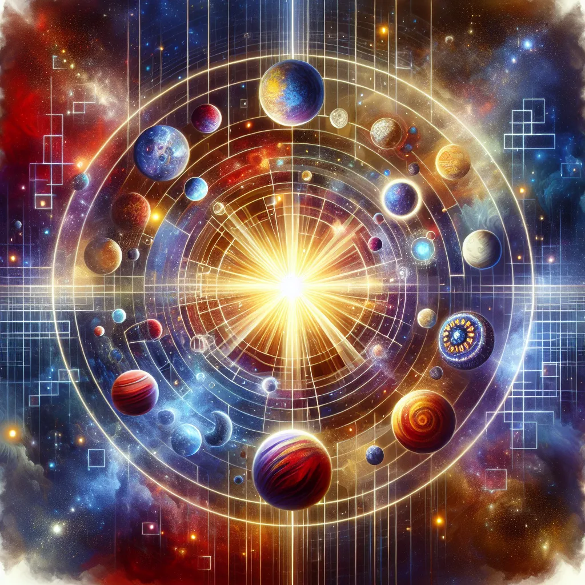

# Mass

An incremental game where you build a solar system by generating mass and buying planets. Implemented with HTML, CSS, and JavaScript.



## Game Description

In this game, you generate mass to build planets and expand your solar system. The more mass you generate, the more planets you can buy. Each planet increases the cost for the next planet, making the game progressively more challenging.

## How to Play

1. **Generate Mass:** Click the "Generate Mass" button to increase your mass.
2. **Buy Planets:** Once you have enough mass, you can buy planets by clicking the "Buy Planet" button. The cost of the next planet will increase each time you buy one.
3. **Expand Your Solar System:** Keep generating mass and buying planets to expand your solar system.

## Live Demo

You can play the game [here](https://abhrankan-chakrabarti.github.io/mass/).

## AI-Generated WebP Image

The background image for this website was created using AI and is in WebP format. The image features a colorful and detailed depiction of a solar system, with planets of various sizes orbiting a central star.

## Files

- **index.html:** The main HTML file for the game.
- **styles.css:** The CSS file for styling the game.
- **script.js:** The JavaScript file containing the game logic.

## Setup

To run the game locally, clone the repository and open `index.html` in your web browser.

```bash
git clone https://github.com/Abhrankan-Chakrabarti/mass.git
cd mass
open index.html
```

## Contributing

Contributions are welcome! Feel free to open an issue or submit a pull request with improvements or bug fixes.

## License

This project is licensed under the MIT License.